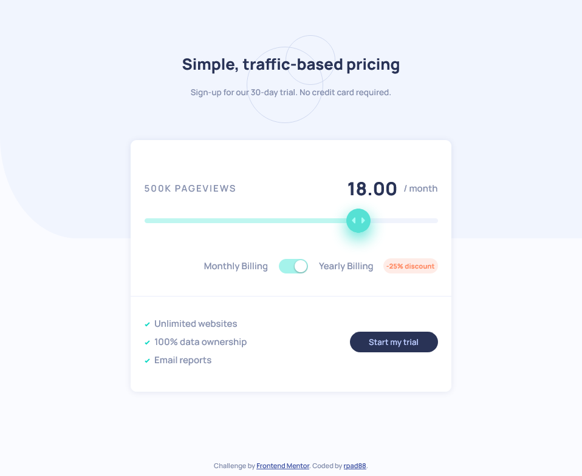

# Frontend Mentor - Interactive pricing component solution

This is a solution to the [Interactive pricing component challenge on Frontend Mentor](https://www.frontendmentor.io/challenges/interactive-pricing-component-t0m8PIyY8). Frontend Mentor challenges help you improve your coding skills by building realistic projects. 

## Table of contents

- [Overview](#overview)
  - [The challenge](#the-challenge)
  - [Screenshot](#screenshot)
  - [Links](#links)
- [My process](#my-process)
  - [Built with](#built-with)
  - [What I learned](#what-i-learned)
  - [Continued development](#continued-development)
  - [Useful resources](#useful-resources)
- [Author](#author)
- [Acknowledgments](#acknowledgments)

## Overview

### The challenge

Users should be able to:

- View the optimal layout for the app depending on their device's screen size
- See hover states for all interactive elements on the page
- Use the slider and toggle to see prices for different page view numbers

### Screenshot



### Links

- [Frontend Mentor solution](https://www.frontendmentor.io/solutions/html-5-css-3-javascript-kIqL9i7wd)
- [Github project](https://github.com/rpad88/interactive-pricing-component-main)
- [Live Site](https://rpad88.github.io/interactive-pricing-component-main/)

## My process

### Built with

- Semantic HTML5 markup
- CSS custom properties
- Flexbox
- Mobile-first workflow
- JavaScript

### What I learned

I liked to learn how to set a linear-gradient to range input, it is important to have a visual effect.

```js
if(myRange.value == 2) {
        let originalPrice = 12.00;
        price.innerHTML = printPrice(originalPrice);        
        views.innerHTML = '50K';
        //set background to linear-gradient color Green from 0% to 25%
        //set background to linear-gradient color Pale Blue from 25% to 100%
        myRange.style.background = 'linear-gradient(to right, hsl(174, 77%, 80%) 0% 25%, hsl(224, 65%, 95%) 25% 100%)';                
    }
```

If you want more help with writing markdown, we'd recommend checking out [The Markdown Guide](https://www.markdownguide.org/) to learn more.


### Continued development

I want to continue focusing on JavaSript, HTML and CSS in future projects to be a front-end developer. 


### Useful resources

- [Example resource 1](https://www.w3schools.com/howto/howto_css_switch.asp) - This helped me to do toggle switch


## Author

- Frontend Mentor - [@rpad88](https://www.frontendmentor.io/profile/rpad88)
- Github - [@rpad88](https://github.com/rpad88)